# JEE_TP2_Spring_Hopitale
<h2> Entité JPA Patient </h2>
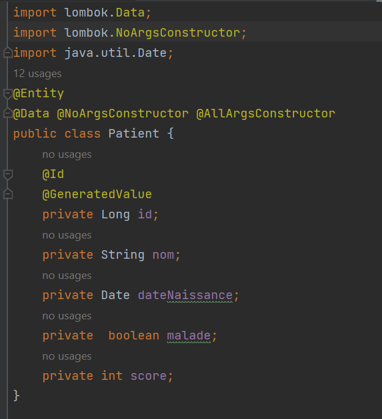
<h3> Configuration de l'unité de persistance dans le fichier application.properties  </h3>
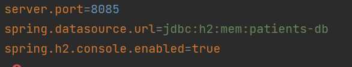
<h3> Création de l'interface JPA Repository basée sur Spring data </h3>
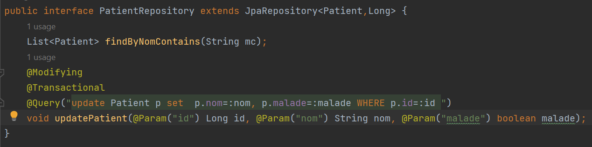
<h3> Quelques opérations de gestion de patients : </h3>
<h3> Ajouter des patients </h3>
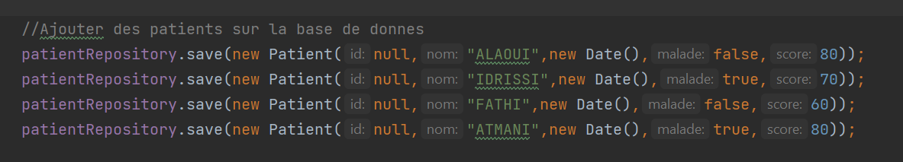
<h3> Consulter tous les patientss </h3>
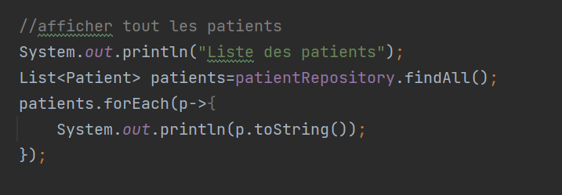
<h3> Consulter un  patient </h3>
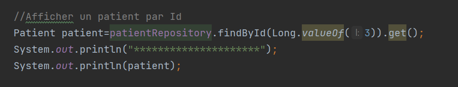
<h3> Chercher des patients </h3>
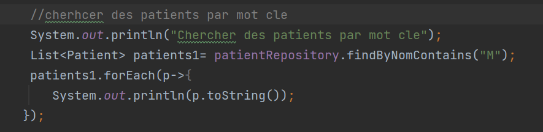
<h3> Mettre à jour un patient  </h3>
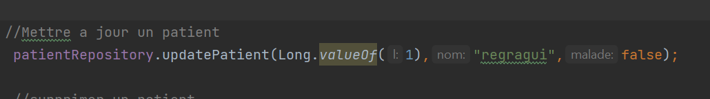
<h3> supprimer un patient </h3>
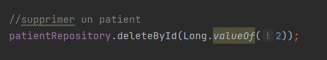
<h3> H2 Database </h3>
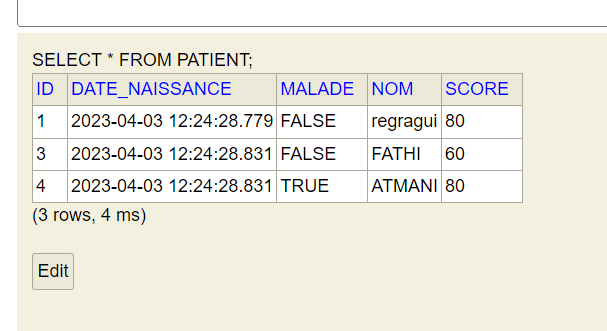
<h2> Version Mysql </h2>
<h3> Migrer de H2 Database vers MySQL </h3>
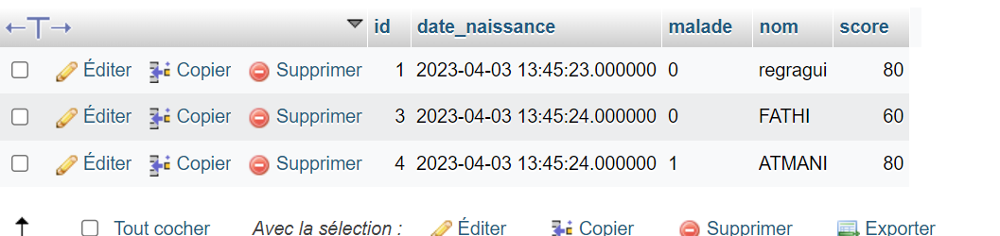
<h3> Output : </h3>
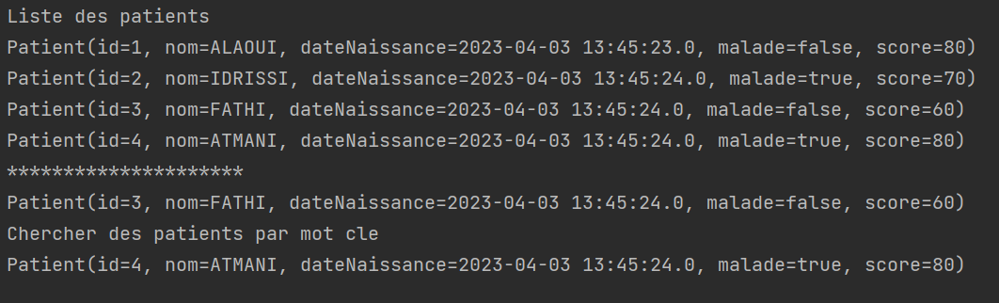

